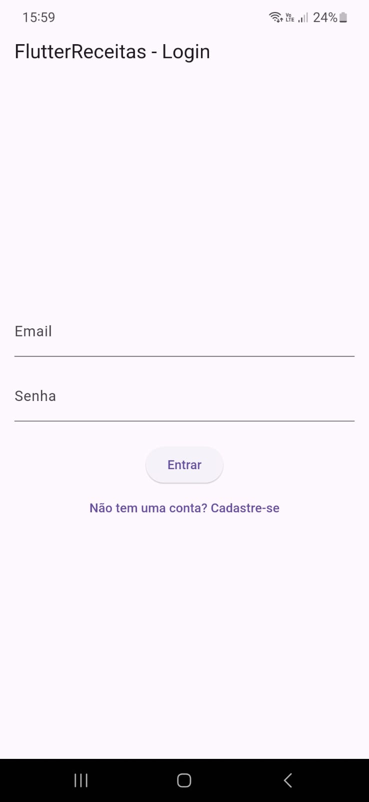
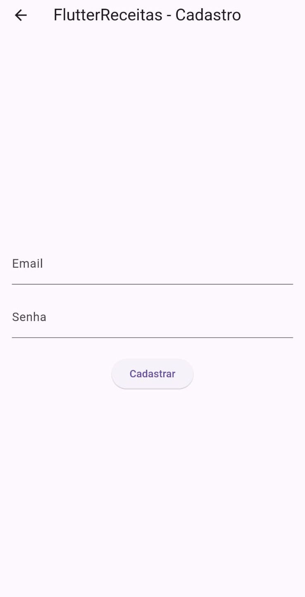
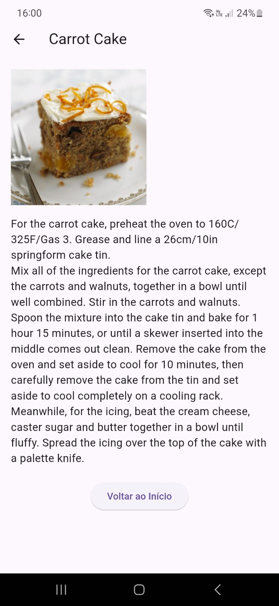

# 📌 Projeto: FlutterReceitas 🍲

---

## 🚀 Descrição
Este projeto é uma aplicação desenvolvida em Flutter que simula um catálogo de receitas culinárias. A aplicação consome dados de uma API pública para listar, buscar e exibir receitas de forma interativa.  
Além disso, o projeto integra **Firebase Authentication** para permitir login e cadastro de usuários com email e senha.

---

## 🎯 Funcionalidades
- ✅ Cadastro de novos usuários com Email/Senha (Firebase Auth)
- ✅ Login de usuários com Email/Senha (Firebase Auth)
- ✅ Listagem de receitas utilizando API pública
- 🔍 Busca de receitas por nome
- 🡩‍🍳 Exibição de detalhes de uma receita selecionada
- 🗜️ Histórico das últimas 5 receitas vistas
- 🚪 Logout de usuário com redirecionamento para login
- 📱 Interface amigável e adaptada para dispositivos móveis

---

## 📷 Preview do Projeto

### 🏠 Tela de Login


### 💾 Tela de Cadastro


### 🍽️ Tela Principal - Lista de Receitas


### 🍲 Tela de Detalhes da Receita


---

## 🛠️ Tecnologias Utilizadas
- 💙 Flutter (SDK)
- 📜 Dart (linguagem principal)
- 🔥 Firebase Core & Firebase Authentication
- 🌐 API pública de receitas: [TheMealDB API](https://www.themealdb.com/api.php)

---

## 📂 Estrutura do Projeto
📂 lib  
 ├️ 📂 pages  
 │ ├️ 📜 login_page.dart  
 │ ├️ 📜 register_page.dart  
 │ ├️ 📜 recipes_page.dart  
 │ └️ 📜 recipe_details_page.dart  
 ├️ 📜 firebase_options.dart  
 └️ 📜 main.dart  
📂 android  
 ├️ 📂 app  
 │ └️ 📜 google-services.json (Firebase Android)  
📂 ios  
 ├️ 📂 Runner  
 │ └️ 📜 GoogleService-Info.plist (Firebase iOS)  
📂 assets  
 └️ 📂 images

---

## 📥 Instalação e Execução
### ✅ Pré-requisitos
- [Flutter SDK](https://flutter.dev/docs/get-started/install) instalado
- Dispositivo Android ou emulador configurado
- Conta no [Firebase Console](https://console.firebase.google.com/)

### 📌 Passos para rodar o projeto
1. Clone o repositório:
   ```bash
   git clone https://github.com/seu-usuario/flutter-receitas-firebase.git
   ```
2. Entre na pasta do projeto:
   ```bash
   cd flutter-receitas-firebase
   ```
3. Instale as dependências:
   ```bash
   flutter pub get
   ```
4. Execute o app:
   ```bash
   flutter run
   ```
5. **Observação:**  
   Para Android, garanta que o arquivo `google-services.json` esteja em `/android/app/`.

---

## 🎮 Como Usar
1. **📝 Cadastro:** Crie uma nova conta utilizando seu email e senha.
2. **🔓 Login:** Faça login com seu email e senha cadastrados.
3. **🔍 Busca de Receitas:** Utilize o campo de busca para pesquisar receitas por nome.
4. **🍲 Ver Detalhes:** Clique em uma receita para ver sua imagem e modo de preparo.
5. **👀 Últimas Vistas:** A Home lista as últimas 5 receitas que você visualizou.
6. **🚪 Logout:** Utilize o botão de logout para sair da aplicação.

---

## 📢 Observações Importantes
- Este projeto está configurado para **rodar em dispositivos Android/iOS**.
- O suporte Web (Flutter Web) ainda necessita ajustes por limitações atuais do FlutLab e compatibilidade do Firebase Web.

---

# ✅ Finalizado!

---
